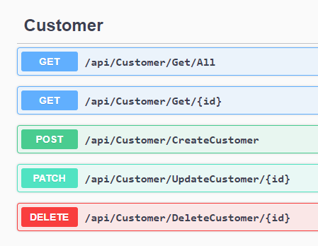
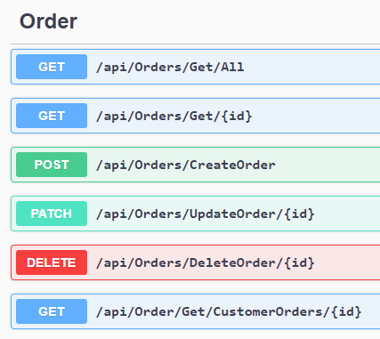

<!DOCTYPE html>
<html>
<body>

<h1>CMPG_323_Project_2_-_38336529</h1>
<h1>Projects and there Reposotories</h1>

<h2>Project Description</h2>

The Creation of a API, used to manage a data source.

The API can be used to manage the given data source in a quick, secure and effective manner.

<h2>Project Manual</h2>

The Project will not allow any unAuthorised access to the endpoints.

The User will first have to register to receive their API Token which is used to authenticate your login to access the API endpoints.

After the Register/Login both work, Register for first time users and login for returning users you can start using the API properly.

<h2>For Customer you have multiple endpoints:<h2>

<h3>Customer Enpoint details</h3>
<ul>
  <li>Get All Customers</li>
  <li>Get a specific Customer which needs a customer ID passed to the endpoint.</li>
  <li>Create a Customer which needs a Title, Name, Surname and Cellphone to be passed to the endpoint.</li>
  <li>Update a Customer which needs a ID of the customer to update and the needed info of what to change.</li>
  <li>Delete a Customer which needs a ID of the customer to delete.</li>
</ul>  

<h2>For Order you have multiple endpoints:<h2>

<h3>Order Enpoint details</h3>
<ul>
  <li>Get All Orders</li>
  <li>Get a specific Order which needs a Order ID passed to the endpoint.</li>
  <li>Create a Order which needs a Orderdate, CustomerID and a deliveryAddress to be passed to the endpoint.</li>
  <li>Update a Order which needs a ID of the Order to update and the needed info of what to change.</li>
  <li>Delete a Order which needs a ID of the Order to delete.</li>
  <li>Get Customer Orders which get all the orders of a specific customer, this endpoint needs a CustomerID passed to it</li>
</ul>  
</body>
</html>
